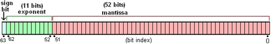
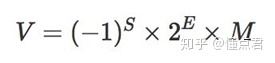
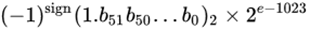

# 0.1+0.2

打开浏览器的控制台，输入以下代码并运行：

```JavaScript
0.1 + 0.2
```

得到的结果是 `0.30000000000000004`，为什么不是 0.3，具体原因需要有以下基础知识作为前置知识点：

- 计算机将所有数据以二进制的形式存储
- 计算机用有限的大小来存储数据（因为现实生活中不存在无限大的内存或硬盘）

## 进制转换

先说说最基本的进制转换：

- **十进制整数转换为二进制整数**  
  方法为十进制数除 2 取余法，即十进制数除 2，余数为权位上的数，得到的商值继续除 2，依此步骤继续向下运算直到商为 0 为止。如十进制数 150，使用该方法步骤如下：
  | 除 2    | 除 2 结果 | 取余    | 取余结果 |
  | ------- | --------- | ------- | -------- |
  | 150 / 2 | 75        | 150 % 2 | 0        |
  | 75 / 2  | 37        | 75 % 2  | 1        |
  | 37 / 2  | 18        | 37 % 2  | 1        |
  | 18 / 2  | 9         | 18 % 2  | 0        |
  | 9 / 2   | 4         | 9 % 2   | 1        |
  | 4 / 2   | 2         | 4 % 2   | 0        |
  | 2 / 2   | 1         | 2 % 2   | 0        |
  | 1 / 2   | 0         | 1 % 2   | 1        |

  有两个知识点是，一是此处相除是取整的，所以 1 / 2 = 0，二是当被取余数小于取余数时，余数就是被取余数本身，如 1 % 2 = 1。

  最后将取余结果从最后一个倒着读到第一个，就是结果，此处十进制数转换为二进制数为 10010110 。

- **二进制整数转十进制整数**  
  方法为把二进制数按权展开、相加即得十进制数。如二进制数 10010110 转换为十进制数，计算如下：  
  1 _ 2 ^ 7 + 0 _ 2 ^ 6 + 0 _ 2 ^ 5 + 1 _ 2 ^ 4 + 0 _ 2 ^ 3 + 1 _ 2 ^ 2 + 1 _ 2 ^ 1 + 0 _ 2 ^ 0 = 150

## 原码

上文说的进制转换，并没有考虑到负数的情况，为了在计算机中想办法表示负数，有一种解决办法：在二进制数值前面增加一位符号位（即最高位为符号位）：正数该位为 0，负数该位为 1，其余位表示数值的大小。

这样，如果我们想要 10 的话，那么就应该是：0 1010，想要表示-10 的话，就应该是 1 1010。

这种编码方式就被称之为**原码**，原码的优点比较明显，那就是非常的简单直观，很容易被人理解。

使用原码，解决了十进制在计算机中的存储问题，但是计算机中还有一个重要的操作那就是计算。使用原码如何计算呢？

首先，原码对于加法的运算是没什么问题的，如`5 + 2`：

```
  0 0 1 0 1
+ 0 0 0 1 0
-----------
  0 0 1 1 1
```

结果是 00111，即 7，没有问题，那么我们再试着用原码来计算减法，例如我们想要计算 10 - 2：

```
  0 1 0 1 0
- 0 0 0 1 0
-----------
  0 1 0 0 0
```

结果是 01000，即 8，没有问题。但是，这个减法其实只是我们的一厢情愿，因为其实计算机算术逻辑单元（ALU）并没有直接进行减法运算，对于减法，其实也是用加法器来实现的。

也就是说，计算机中的所有的减法运算都需要转换成加法运算，那么 10 - 2 其实就是 10 + （-2）：

```
  0 1 0 1 0
+ 1 0 0 1 0
-----------
  1 1 1 0 0
```

得到的结果是 11100，考虑符号位，结果是-12，这明显是错误的。

可见，原码虽然对于人类来说是比较简单直观的，但是对于计算机来说却带来了很大的计算难度。

## 反码

因为原码虽然容易被人理解，但是给计算机的计算带来了一定的困难，尤其是减法的运算。所以，人们发明出反码来解决减法运算的问题。

**反码是基于原码计算得来的，表示方式是：正数的反码是其本身。负数的反码是在其原码的基础上, 符号位不变，其余各个位取反。**

如，10 的 原码为 0 1010 ，那么他的反码同样也是 0 1010 。

如，-2 的原码为 1 0010 ，那么他的反码为 1 1101 。

有了反码之后，二进制的运算就可以带着符号位一起了。并且可以直接将减法转换成加法进行运算。但是使用反码进行运算，需要注意以下几点：

- 反码运算时，其符号位与数值一起参加运算。
- 反码的符号位相加后，如果有进位出现，则要把它送回到最低位去相加（循环进位）。
- 用反码运算，其运算结果亦为反码。在转换为真值时，若符号位为 0，数位不变；若符号位为 1，应将结果求反才是其真值。

如 10 - 2 的在计算时需要转成 10 + (-2)进行计算：

```
  0 1 0 1 0
+ 1 1 1 0 1
-----------
  0 1 0 0 0
```

再来计算法 2 - 10 ，把 2 - 10 转换成 2 + （-10）进行计算：

```
  0 0 0 1 0
+ 1 0 1 0 1
-----------
  1 0 1 1 1
由于符号位为1，所以需要将结果求反，结果为
  1 1 0 0 0
```

但是，反码运算还是有一个小问题，我们尝试计算 10 - 10 ，即 10 + （-10）：

```
  0 1 0 1 0
+ 1 0 1 0 1
-----------
  1 1 1 1 1
由于符号位为1，所以需要将结果求反，结果原码为
  1 0 0 0 0
```

所以结果对应的原码是 1 0000（原），即十进制-0。

虽然很多人够能够理解+0 和-0 其实是一样的，但是 0 带符号仍然是没有任何意义的。

如果一台计算机有 8 位，我们想要用反码表示 0 的话，就有 0000 0000 和 1111 1111 两种方式，分别表示+0 和-0。

## 补码

虽然反码解决了减法的问题，但是对于 0 的符号问题却没有解决，于是补码出现了。

**补码是在原码和反码的基础上衍生出来的，补码的表示方法是：正数的补码就是其本身，负数的补码是在其原码的基础上， 符号位不变， 其余各位取反，最后+1。(即在反码的基础上+1，如果最高位又进位就舍弃)**

补码计算的规则：

- 补码运算时，其符号位与数值一起参加运算。
- 补码的符号位相加后，如果有进位出现，则进位被舍弃。
- 用补码运算，其运算结果亦为补码。在转换成原码时，如果是正数，其补码就是原码；如果是负数，该补码的补码就是其原码。

用补码的方式，来计算下 10 - 10 ：

```
  0 1 0 1 0
+ 1 0 1 1 0
-----------
  0 0 0 0 0
由于符号位为0，所以正数的补码就是其本身，结果原码为
  0 0 0 0 0
```

01010（补） + 10110（补） = 0 0000 （补），因为符号位是 0，表示正数，所以他对应的原码也是 0 0000（原），则十进制为 0。

有了补码，0 的表达方式就唯一了，如果是 8 位的话，那么就是固定的 0000 0000。

如果使用原码或者反码，8 位的原码或者反码能表示的最小数字是-127，而使用补码，能表示的最小数字是-128。

可见，使用补码, 不仅仅修复了 0 的符号以及存在两个编码的问题, 而且还能够多表示一个最低数。这就是为什么 8 位二进制, 使用原码或反码表示的范围为[-127, +127], 而使用补码表示的范围为[-128, 127]。

## 使用补码的原因

通过以上介绍，我们知道了原码、反码和补码的一些知识，我们尝试着总结下为什么计算机中会最终选择补码来进行存储和计算数字。

1. 计算机的运算器为了实现简单，倾向于在运算过程中将减法转换成加法，统一使用加法运算器进行计算。想要把减法转化成加法运算，就需要在运算时带着符号一起运算，而反码和补码可以带符号位一起运算，也就方便了将减法转换为加法。

2. 采用补码，可以解决编码中有+0 和-0 两种表示 0 的方式。

3. 补码表示的数字范围要比原码和反码大。如 8 位 2 进制，使用原码或反码表示的范围为[-127, +127], 而使用补码表示的范围为[-128, 127]。

额外使用补码计算 8 - 10，即 8 + (-10)，8 为正数，所以原码为 01000，补码等于原码，为 01000。-10 为负数，原码为 11010，反码为 10101，补码为反码+1，即 10110，开始计算：

```
  0 1 0 0 0
+ 1 0 1 1 0
-----------
  1 1 1 1 0
由于符号位为1，所以该补码的补码即为结果，先求反码：
  1 0 0 0 1
再加1：
  1 0 0 1 0
```

最后结果为 10010，即-2。

## 十进制小数转换成二进制小数

以上都是整数相关的部分，十进制小数转换成二进制小数采用"乘2取整，顺序排列"法。具体做法是：

- 用 2 乘十进制小数，可以得到积
- 将积的整数部分取出，再用 2 乘余下的小数部分，又得到一个积
- 再将积的整数部分取出，如此进行，直到积中的小数部分为零，此时 0 或 1 为二进制的最后一位。或者达到所要求的精度为止

比如说，求十进制的 0.625 对应的二进制，步骤如下：
| 乘 2             | 小数部分 | 整数部分 |
| ---------------- | -------- | -------- |
| 0.625 _ 2 = 1.25 | 0.25     | 1        |
| 0.25 _ 2 = 0.5   | 0.5      | 0        |
| 0.5 \* 2 = 1.0   | 0        | 1        |

所以，十进制的 0.625 对应的二进制就是 0.101。

但是不是所有数都能用二进制表示

前面的例子中 0.625 是一个特例，用同样的算法计算下 0.1 对应的二进制：
| 乘 2          | 小数部分 | 整数部分 |
| ------------- | -------- | -------- |
| 0.1 _ 2 = 0.2 | 0.2      | 0        |
| 0.2 _ 2 = 0.4 | 0.4      | 0        |
| 0.4 _ 2 = 0.8 | 0.8      | 0        |
| 0.8 _ 2 = 1.6 | 0.6      | 1        |
| 0.6 _ 2 = 1.2 | 0.2      | 1        |
| 0.2 _ 2 = 0.4 | 0.4      | 0        |
| 0.4 _ 2 = 0.8 | 0.8      | 0        |
| 0.8 _ 2 = 1.6 | 0.6      | 1        |
| 0.6 _ 2 = 1.2 | 0.2      | 1        |
| 0.2 _ 2 = 0.4 | 0.4      | 0        |
| 0.4 _ 2 = 0.8 | 0.8      | 0        |
| 0.8 _ 2 = 1.6 | 0.6      | 1        |
| ...           | ...      | ...      |

可以发现 0.1 的二进制表示中出现了无限循环的情况，也就是(0.1)10 = (0.000110011001100…)2。

这种情况，计算机就没办法用二进制精确的表示 0.1 了。

**也就是说，对于像 0.1 这种数字，我们是没办法将他转换成一个确定的二进制数的。**

## IEEE 754 介绍

为了解决部分小数无法使用二进制精确表示的问题，于是就有了 IEEE 754 规范。

IEEE 二进制浮点数算术标准（IEEE 754）是 20 世纪 80 年代以来最广泛使用的浮点数运算标准，为许多 CPU 与浮点运算器所采用。

> 浮点数和小数并不是完全一样的，计算机中小数的表示法，其实有定点和浮点两种。因为在位数相同的情况下，定点数的表示范围要比浮点数小。所以在计算机科学中，使用浮点数来表示实数的近似值。

IEEE 754 规定了四种表示浮点数值的方式：单精确度（32 位）、双精确度（64 位）、延伸单精确度（43 比特以上，很少使用）与延伸双精确度（79 比特以上，通常以 80 位实现）。

其中最常用的就是 32 位单精度浮点数和 64 位双精度浮点数。

**IEEE 并没有解决小数无法精确表示的问题，只是提出了一种使用近似值表示小数的方式，并且引入了精度的概念。**

下面回到正题，由于小数在计算机中的表示是近似数，并不是真实值。根据精度不同，近似程度也有所不同，所以小数的计算也是近似值的。

JS 数字类型只有 number 类型，number 类型相当于其他强类型语言中的 double 类型(双精度浮点型)，不区分浮点型和整数型，其中 64 位 = 1 位符号位 + 11 位指数位 + 52 位小数位。

## IEEE 754 标准

### 浮点数存储格式



上图是64位的双精度浮点数，最高位是符号位S（sign），中间的11位是指数E（exponent），剩下的52位为尾数（有效数字）M（mantissa）。

### 浮点数科学计数法

根据IEEE 754标准，任意一个浮点数的二进制都可以用如下公式进行表示：



S为符号位：表示浮点数的正负（0代表正数，1代表负数）；

E为指数位：存储指数，该数都会加上一个常数（偏移量），用来表示次方数；

M为尾数位：表示有效位（尾数），超出的部分自动进1舍0；

双精度的浮点数真值（带有正负号的数值是真值）最终可以表示为：



**说明**：E是无符号整数，长度是11位，取值范围是为0~2047。因为科学计数法中的指数是可以为负数，所以约定减去一个中间数（偏移量）1023，[0，1022] 表示为负，[1024，2047] 表示为正。

### 浮点数二进制运算

#### 规格化

大部分二进制浮点数都以规格化格式进行存放，以便将有效数字的精度最大化，提升精确度。

#### 0.1的二进制

0.000110011001100110011001100110011001100110011001100110011...... (0011无限循环)

#### 0.1科学计数法表示

小数点向右移动4位，让其小数点左边只有一个“1”。

1.1001100110011001100110011001100110011001100110011001**1**......(0011无限循环) * 2^-4

根据IEEE754标准，双精度浮点的尾数只能存储52位，加粗的“1”是第53位，根据进1舍0的原则进行操作，操作后的值为：

1.1001100110011001100110011001100110011001100110011010* 2^-4

#### 0.1二进制存储格式

指数-4等于1019（E） – 1023（常量），由此可得E等于1019，把1019转为二进制1111111011。

最终表示如下：

0,01111111011;1001100110011001100110011001100110011001100110011010

**说明**：第一部分为符号位；第二部分为指数位；第三部分为尾数位；

#### 0.2的二进制

0.001100110011001100110011001100110011001100110011001100110011...... (0011无限循环)

#### 0.2科学计数法表示

小数点向右移动3位，让其小数点左边只有一个“1”。

1.1001100110011001100110011001100110011001100110011001**1**......(0011无限循环) * 2^-3

加粗的“1”是第53位，根据进1舍0的原则进行操作，操作后的值为：

1.1001100110011001100110011001100110011001100110011010 * 2^-3

#### 0.2二进制存储格式

指数-3等于1020（E） – 1023（常量），由此可得E等于1020，把1020转为二进制1111111100。

最终表示如下：

0,01111111100;1001100110011001100110011001100110011001100110011010

**说明**：第一部分为符号位；第二部分为指数位；第三部分为尾数位；

#### 对阶

此时：
0.1 -> 0,01111111011;1001100110011001100110011001100110011001100110011010
0.2 -> 0,01111111100;1001100110011001100110011001100110011001100110011010

科学计数法表示：
0.1 -> 1.1001100110011001100110011001100110011001100110011010 * 2^-4
0.2 -> 1.1001100110011001100110011001100110011001100110011010 * 2^-3

对阶的目的是使两数的小数点位置对齐，方便两数进行运算，换句话说就是两数的阶码要相等。根据小阶向大阶看齐的原则，应使0.1的尾数向右移动1位（可以理解为小数点向左移动1位），阶码加1，这时根据进1舍0的原则最右侧的0被舍去。

尾数向右移动1位后，变化如下：

科学计数法表示：
0.1 -> 0.1100110011001100110011001100110011001100110011001101 * 2^-3
0.2 -> 1.1001100110011001100110011001100110011001100110011010 * 2^-3

所以0.1 + 0.2 = (0.1100110011001100110011001100110011001100110011001101 + 1.1001100110011001100110011001100110011001100110011010) * 2^-3

结果可得：
10.0110011001100110011001100110011001100110011001100111* 2^-3

#### 结果规格化

根据尾数求和的结果，进行规格化处理，即尾数向右移1位，阶码加1。

1.0011001100110011001100110011001100110011001100110011**1** * 2^-2

尾数只能存储52位，加粗的“1”需要舍去，根据进1舍0的原则进行操作可得：

1.0011001100110011001100110011001100110011001100110100* 2^-2

#### 规格化转为非规格化

指数的值为2，将规格化的小数点向左移动2位即可。

1.0011001100110011001100110011001100110011001100110100* 2^-2

——>

0.010011001100110011001100110011001100110011001100110100

#### 非规格化的值转成十进制

0.1 + 0.2 = 0.3000000000000000444089209850062616169452667236328125

如果我们在浏览器控制台执行 `0.1 + 0.2`，结果是0.30000000000000004，如果执行 `(0.1+0.2).toFixed(52)` 那么结果就是0.3000000000000000444089209850062616169452667236328125，和我们的计算结果相同了。

### 乘2取整法的原理


### 如何解决浮点数相加带来的精度问题


### 参考文章

- [漫话：为什么计算机用补码存储数据？](https://mp.weixin.qq.com/s?__biz=Mzg3MjA4MTExMw==&mid=2247493568&idx=1&sn=8c445ca35300fde5a4f53685cc564dac&chksm=cef61476f9819d603a9f15690267885e8b96c90747c71f9c8408b4bdfe0d1c515ee0fc3b8847&scene=21#wechat_redirect)
- [漫话：如何给女朋友解释为什么计算机中 0.2 + 0.1 不等于 0.3 ？](https://zhuanlan.zhihu.com/p/265281184)
- [原理解析 | JavaScript 计算0.1 + 0.2真的很难，看完才知道！](https://zhuanlan.zhihu.com/p/159075016)
