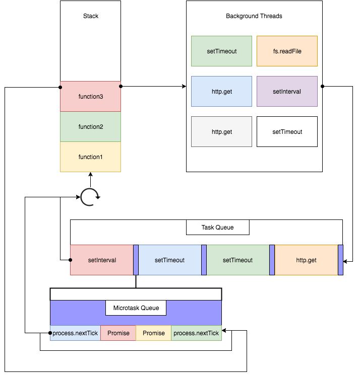
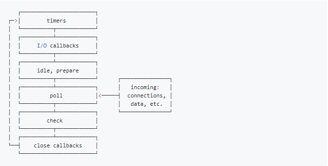

# Event Loop

## Event Loop 是什么

event loop 是一个执行模型，在不同的地方有不同的实现。浏览器和 NodeJS 基于不同的技术实现了各自的 Event Loop。

- 浏览器的 Event Loop 是在 html5 的规范中明确定义。
- NodeJS 的 Event Loop 是基于 libuv 实现的。
- libuv 已经对 Event Loop 做出了实现，而 HTML5 规范中只是定义了浏览器中 Event Loop 的模型，具体的实现留给了浏览器厂商。

## 宏队列和微队列

**宏队列，macrotask，也叫 tasks**。 一些异步任务的回调会依次进入 macro task queue，等待后续被调用，这些异步任务包括：

- setTimeout
- setInterval
- setImmediate (Node 独有)
- requestAnimationFrame (浏览器独有)
- I/O
- UI rendering (浏览器独有)

**微队列，microtask，也叫 jobs**。 另一些异步任务的回调会依次进入 micro task queue，等待后续被调用，这些异步任务包括：

- process.nextTick (Node 独有)
- Promise
- Object.observe
- MutationObserver

## 浏览器的 Event Loop

如下图：



这张图将浏览器的 Event Loop 完整的描述了出来，讲执行一个 JavaScript 代码的具体流程如下：

1. 执行全局 Script 同步代码，这些同步代码有一些是同步语句，有一些是异步语句（比如 setTimeout 等）；
2. 全局 Script 代码执行完毕后，调用栈 Stack 会清空；
3. 从微队列 microtask queue 中取出位于队首的回调任务，放入调用栈 Stack 中执行，执行完后 microtask queue 长度减 1；
4. 继续取出位于队首的任务，放入调用栈 Stack 中执行，以此类推，直到直到把 microtask queue 中的所有任务都执行完毕。**注意，如果在执行 microtask 的过程中，又产生了 microtask，那么会加入到队列的末尾，也会在这个周期被调用执行**；
5. microtask queue 中的所有任务都执行完毕，此时 microtask queue 为空队列，调用栈 Stack 也为空；
6. 取出宏队列 macrotask queue 中位于队首的任务，放入 Stack 中执行；
7. 执行完毕后，调用栈 Stack 为空；
8. 重复第 3-7 个步骤；
9. 重复第 3-7 个步骤；
10. ......

**可以看到，这就是浏览器的事件循环 Event Loop**

这里归纳 3 个重点：

- 宏队列 macrotask 一次只从队列中取一个任务执行，执行完后就去执行微任务队列中的任务；
- 微任务队列中所有的任务都会被依次取出来执行，直到 microtask queue 为空；
- 图中没有画 UI rendering 的节点，因为这个是由浏览器自行判断决定的，但是只要执行 UI rendering，它的节点是在执行完所有的 microtask 之后，下一个 macrotask 之前，紧跟着执行 UI render。

相关例子

```JavaScript
console.log(1);

setTimeout(() => {
  console.log(2);
  Promise.resolve().then(() => {
    console.log(3)
  });
});

new Promise((resolve, reject) => {
  console.log(4)
  resolve(5)
}).then((data) => {
  console.log(data);

  Promise.resolve().then(() => {
    console.log(6)
  }).then(() => {
    console.log(7)

    setTimeout(() => {
      console.log(8)
    }, 0);
  });
})

setTimeout(() => {
  console.log(9);
})

console.log(10);
```

正确答案

```JavaScript
// 正确答案
1
4
10
5
6
7
2
3
9
8
```

这里的关键是：

在执行微队列 microtask queue 中任务的时候，如果又产生了 microtask，那么会继续添加到队列的末尾，也会在这个周期执行，直到 microtask queue 为空停止。

当然如果在 microtask 中不断的产生 microtask，那么其他宏任务 macrotask 就无法执行了，但是这个操作也不是无限的，拿 NodeJS 中的微任务 process.nextTick()来说，它的上限是 1000 个。

## NodeJS 中的 Event Loop

NodeJS 中的 Event Loop，它更复杂一些，机制也不太一样。

### NodeJS 中的宏队列和微队列

NodeJS 的 Event Loop 中，执行宏队列的回调任务有 6 个阶段，如下图：



各个阶段执行的任务如下：

- timers 阶段：这个阶段执行 setTimeout 和 setInterval 预定的 callback
- I/O callback 阶段：执行除了 close 事件的 callbacks、被 timers 设定的 callbacks、setImmediate()设定的 callbacks 这些之外的 callbacks
- idle, prepare 阶段：仅 node 内部使用
- poll 阶段：获取新的 I/O 事件，适当的条件下 node 将阻塞在这里
- check 阶段：执行 setImmediate()设定的 callbacks
- close callbacks 阶段：执行 socket.on('close', ....)这些 callbacks

由上面的介绍可以看到，NodeJS 中宏队列主要有 4 个，回调事件主要位于 4 个 macrotask queue 中：

- Timers Queue
- IO Callbacks Queue
- Check Queue
- Close Callbacks Queue

这 4 个都属于宏队列，但是在浏览器中，可以认为只有一个宏队列，所有的 macrotask 都会被加到这一个宏队列中，但是在 NodeJS 中，不同的 macrotask 会被放置在不同的宏队列中。

NodeJS 中微队列主要有 2 个：

- Next Tick Queue：是放置 process.nextTick(callback)的回调任务的
- Other Micro Queue：放置其他 microtask，比如 Promise 等

在浏览器中，也可以认为只有一个微队列，所有的 microtask 都会被加到这一个微队列中，但是在 NodeJS 中，不同的 microtask 会被放置在不同的微队列中。

具体可以通过下图加深一下理解：


大体解释一下 NodeJS 的 Event Loop 过程：

1. 执行全局 Script 的同步代码
2. 执行 microtask 微任务，先执行所有 Next Tick Queue 中的所有任务，再执行 Other Microtask Queue 中的所有任务
3. 开始执行 macrotask 宏任务，共 6 个阶段，从第 1 个阶段开始执行相应每一个阶段 macrotask 中的所有任务，注意，这里是所有每个阶段宏任务队列的所有任务，在浏览器的 Event Loop 中是只取宏队列的第一个任务出来执行，每一个阶段的 macrotask 任务执行完毕后，开始执行微任务，也就是步骤 2
4. Timers Queue -> 步骤 2 -> I/O Queue -> 步骤 2 -> Check Queue -> 步骤 2 -> Close Callback Queue -> 步骤 2 -> Timers Queue ......

注意：在新版本中，宏任务从一次执行一个阶段全部任务变成了一次执行一个人物，和浏览器的event loop保持一致。但是之后的例子还是按照旧版本的规则。

第一个例子：

```JavaScript
console.log('start');

setTimeout(() => {          // callback1
  console.log(111);
  setTimeout(() => {        // callback2
    console.log(222);
  }, 0);
  setImmediate(() => {      // callback3
    console.log(333);
  })
  process.nextTick(() => {  // callback4
    console.log(444);
  })
}, 0);

setImmediate(() => {        // callback5
  console.log(555);
  process.nextTick(() => {  // callback6
    console.log(666);
  })
})

setTimeout(() => {          // callback7
  console.log(777);
  process.nextTick(() => {  // callback8
    console.log(888);
  })
}, 0);

process.nextTick(() => {    // callback9
  console.log(999);
})

console.log('end');
```

答案：

```JavaScript
// 正确答案
start
end
999
111
777
444
888
555
333
666
222
```

> 上面这段代码执行的结果可能会有多种情况，原因解释如下。
>
> setTimeout(fn, 0)不是严格的 0，一般是 setTimeout(fn, 3)或什么，会有一定的延迟时间，当 setTimeout(fn, 0)和 setImmediate(fn)出现在同一段同步代码中时，就会存在两种情况。
>
> 第 1 种情况：同步代码执行完了，Timer 还没到期，setImmediate 回调先注册到 Check Queue 中，开始执行微队列，然后是宏队列，先从 Timers Queue 中开始，发现没回调，往下走直到 Check Queue 中有回调，执行，然后 timer 到期（只要在执行完 Timer Queue 后到期效果就都一样），timer 回调注册到 Timers Queue 中，下一轮循环执行到 Timers Queue 中才能执行那个 timer 回调；所以，这种情况下，setImmediate(fn)回调先于 setTimeout(fn, 0)回调执行。
>
> 第 2 种情况：同步代码还没执行完，timer 先到期，timer 回调先注册到 Timers Queue 中，执行到 setImmediate 了，它的回调再注册到 Check Queue 中。 然后，同步代码执行完了，执行微队列，然后开始先执行 Timers Queue，先执行 Timer 回调，再到 Check Queue，执行 setImmediate 回调；所以，这种情况下，setTimeout(fn, 0)回调先于 setImmediate(fn)回调执行。
>
> 所以，在同步代码中同时调 setTimeout(fn, 0)和 setImmediate 情况是不确定的，但是如果把他们放在一个 IO 的回调，比如 readFile('xx', function () {// ....})回调中，那么 IO 回调是在 IO Queue 中，setTimeout 到期回调注册到 Timers Queue，setImmediate 回调注册到 Check Queue，IO Queue 执行完到 Check Queue，timer Queue 得到下个周期，所以 setImmediate 回调这种情况下肯定比 setTimeout(fn, 0)回调先执行。
>
> 综上，这个例子是不太好的，setTimeout(fn, 0)和 setImmediate(fn)如果想要保证结果唯一，就放在一个 IO Callback 中吧，上面那段代码可以把所有它俩同步执行的代码都放在一个 IO Callback 中，结果就唯一了。

第二个例子：

```JavaScript
console.log('1');

setTimeout(function() {
    console.log('2');
    process.nextTick(function() {
        console.log('3');
    })
    new Promise(function(resolve) {
        console.log('4');
        resolve();
    }).then(function() {
        console.log('5')
    })
})

new Promise(function(resolve) {
    console.log('7');
    resolve();
}).then(function() {
    console.log('8')
})
process.nextTick(function() {
  console.log('6');
})

setTimeout(function() {
    console.log('9');
    process.nextTick(function() {
        console.log('10');
    })
    new Promise(function(resolve) {
        console.log('11');
        resolve();
    }).then(function() {
        console.log('12')
    })
})
```

答案：

```JavaScript
// 正确答案
1
7
6
8
2
4
9
11
3
10
5
12
```

可以理解为，在nodejs的event loop中，微任务会在当前循环执行，宏人物会在下一个循环执行。

### setTimeout 对比 setImmediate
- setTimeout(fn, 0)在Timers阶段执行，并且是在poll阶段进行判断是否达到指定的timer时间才会执行
- setImmediate(fn)在Check阶段执行

两者的执行顺序要根据当前的执行环境才能确定：

- 如果两者都在主模块(main module)调用，那么执行先后取决于进程性能，顺序随机
- 如果两者都不在主模块调用，即在一个I/O Circle中调用，那么setImmediate的回调永远先执行，因为会先到Check阶段

### setImmediate 对比 process.nextTick
- setImmediate(fn)的回调任务会插入到宏队列Check Queue中
- process.nextTick(fn)的回调任务会插入到微队列Next Tick Queue中
- process.nextTick(fn)调用深度有限制，上限是1000，而setImmedaite则没有


## 参考文章
[带你彻底弄懂Event Loop](https://segmentfault.com/a/1190000016278115)

