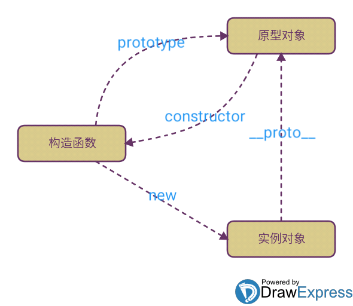

# 原型和原型链

## 原型 prototype 和 __proto__

- 每个对象都有一个__proto__属性，并且指向它的prototype原型对象
- 每个构造函数都有一个prototype原型对象
- prototype原型对象里的constructor指向构造函数本身



实例对象的__proto__指向构造函数的prototype，从而实现继承。

prototype对象相当于特定类型所有实例对象都可以访问的公共容器。


比如如下的示例代码：

```JavaScript
function Person(nick, age) {
  this.nick = nick;
  this.age = age;
}
Person.prototype.sayName = function () {
  console.log(this.nick);
};

var p1 = new Person("Byron", 20);
var p2 = new Person("Casper", 25);

p1.sayName(); // Byron
p2.sayName(); // Casper

p1.__proto__ === Person.prototype; //true
p2.__proto__ === Person.prototype; //true
p1.__proto__ === p2.__proto__; //true
Person.prototype.constructor === Person; //true
```

有以下两个注意的点：
1. 在 `Object.prototype.__proto__` 已被大多数浏览器厂商所支持的今天，其存在和确切行为仅在ECMAScript 2015规范中被标准化为传统功能，以确保Web浏览器的兼容性。为了更好的支持，建议只使用 `Object.getPrototypeOf()`。
2. `Object.create(null)` 新建的对象是没有 `__proto__` 属性的。

## 原型链

当试图访问一个对象的属性时，它不仅仅在该对象上搜寻，还会搜寻该对象的原型，以及该对象的原型的原型，依次层层向上搜索，直到找到一个名字匹配的属性或到达原型链的末尾。

以查找一个数组实例obj的valueOf方法的过程为例，代码如下

```JavaScript
var arr = [1,2,3]
arr.valueOf()  //  [1, 2, 3]
```

大致流程如下：
1. 在当前实例对象obj，查找obj的属性或方法，找到后返回。
2. 没有找到，通过 `obj. __proto__` ，找到obj构造函数的prototype并且查找上面的属性和方法，找到后返回。
3. 没有找到，把obj构造函数的prototype当作obj，重复以上步骤。

当然不会一直找下去，原型链是有终点的，最后查找到Object.prototype时
`Object.prototype.__proto__ === null`，意味着查找结束。


我们来看看上图中的关系：

```JavaScript
arr.__proto__ === Array.prototype //true
Array.prototype.__proto__ === Object.prototype //true
arr.__proto__.__proto__ === Object.prototype //true

// 原型链的终点
Object.prototype.__proto__ === null //true
```

**原型链如下：**
```JavaScript
arr ---> Array.prototype ---> Object.prototype ---> null
```

**这就是传说中的原型链，层层向上查找，最后还没有就返回undefined**

## 原型继承

### 什么是继承？

> 继承是指一个对象直接使用另外一个对象的属性和方法

由此可见只要实现属性和方法的继承，就达到继承的效果。

#### 属性如何继承？

我们先创建一个Person类

```JavaScript
function Person (name, age) {
    this.name = name
    this.age = age
}

// 方法定义在构造函数的原型上
Person.prototype.getName = function () { console.log(this.name)}
```

此时我想创建一个Teacher类，我希望它可以继承Person所有的属性，并且额外添加属于自己特定的属性。

此处我们想要添加的新属性是subject —— 这个属性包含了教师教授的学科。

定义Teacher的构造函数：

```JavaScript
function Teacher (name, age, subject) {
    Person.call(this, name, age)
    this.subject = subject
}
```

属性的继承是通过在一个类内执行另外一个类的构造函数，通过call指定this为当前执行环境，这样就可以得到另外一个类的所有属性。

#### 方法如何继承？

我们需要让Teacher从Person的原型对象里继承方法。我们要怎么做呢？

我们都知道类的方法都定义在prototype里，那其实我们只需要把Person.prototype的备份赋值给Teacher.prototype即可

```JavaScript
Teacher.prototype = Object.create(Person.prototype);
```

Object.create简单说就是新建一个对象，使用现有的对象赋值给新建对象的`__proto__` 。

为什么是备份呢？因为如果直接赋值，那会是引用关系，意味着修改Teacher. prototype，也会同时修改Person.prototype，这是不合理的。

另外注意一点就是，在给Teacher类添加方法时，应该在修改prototype以后，否则会被覆盖掉，原因是赋值前后的属性值是不同的对象。

最后还有一个问题，我们都知道prototype里有个属性constructor指向构造函数本身，但是因为我们是复制其他类的prototype，所以这个指向是不对的，需要更正一下。
如果不修改，会导致我们类型判断出错。

```JavaScript
Teacher.prototype.constructor = Teacher
```

所以最终的解决方案为：

```JavaScript
function Person(name, age) {
  this.name = name;
  this.age = age;
}

// 方法定义在构造函数的原型上
Person.prototype.getName = function () {
  console.log(this.name);
};

function Teacher(name, age, subject) {
  Person.call(this, name, age);
  this.subject = subject;
}

Teacher.prototype = Object.create(Person.prototype);
Teacher.prototype.constructor = Teacher;
```

## 参考文章
- [说说原型（prototype）、原型链和原型继承](https://zhuanlan.zhihu.com/p/35790971)