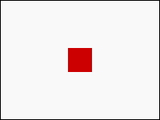
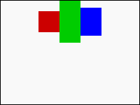
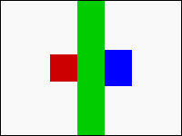
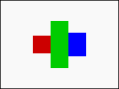
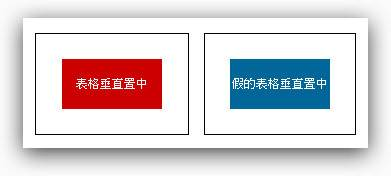
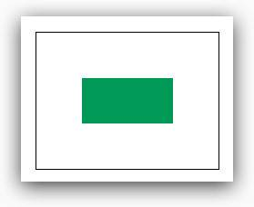
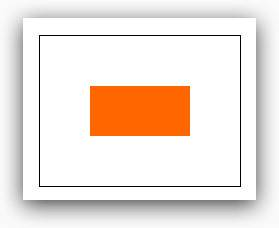
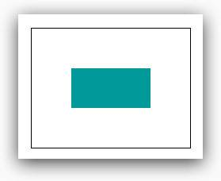

# CSS 垂直居中

我们在编辑一个版面，通常都会用到水平居中和垂直居中来设计，而水平居中很好处理，不外乎就是设定 margin:0 auto；或是 text-align:center；，就可以轻松解决掉水平居中的问题，但一直以来最麻烦对齐问题，都是“垂直居中”这个讨人厌的设定，以下将介绍七种单纯利用 CSS 垂直居中的方式。

## 设定行高（line-height）

设定行高是垂直居中最简单的方式，适用于“单行”的“行内元素”（inline、inline-block），例如单行的标题，或是已经设为 inline-block 属性的 div，若将 line-height 设成和高度一样的数值，则内容的行内元素就会被垂直居中，因为是行高，所以会在行内元素的上下都加上行高的 1/2，所以就垂直居中了！不过由此就可以看出，为什么必须要单行的行内元素，因为如果多行，第二行与第一行的间距会变超大，就不是我们所期望的效果了。CSS 示例：



```CSS
.div0{
  width:200px;
  height:150px;
  border:1px solid #000;
  line-height:150px;
  text-align:center;
}
.redbox{
  display:inline-block;
  width:30px;
  height:30px;
  background:#c00;
}
```

## 添加伪元素（::before、::after）

刚刚第一种方法，虽然是最简单的方法（适用于单行标题），不过就是只能单行，所以我们如果要让多行的元素也可以垂直居中，就必须要使用伪元素的方式。在此之前，先解释一下 CSS 里头 vertical-align 这个属性，这个属性虽然是垂直居中，不过却是指在元素内的所有元素垂直位置互相居中，并不是相对于外框的高度垂直居中。（下面的 CSS 会造成这种样子的垂直居中）



```CSS
.div0{
  width:200px;
  height:150px;
  border:1px solid #000;
  text-align:center;
}
.redbox{
  width:30px;
  height:30px;
  background:#c00;
  display:inline-block;
  vertical-align:middle;
}
.greenbox{
  width:30px;
  height:60px;
  background:#0c0;
  display:inline-block;
  vertical-align:middle;
}
.bluebox{
  width:30px;
  height:40px;
  background:#00f;
  display:inline-block;
  vertical-align:middle;
}
```

因此，如果有一个方块变成了高度 100%，那么其他的方块就会真正的垂直居中。


```CSS
.greenbox{
  width:30px;
  height:100%;
  background:#0c0;
  display:inline-block;
  vertical-align:middle;
}
```

但是我们总不能每次要垂直居中，都要添加一个奇怪的 div 在里头吧！所以我们就要把脑筋动到“伪元素”身上，利用::before 和::after 添加 div 进到杠杠内，让这个“伪”div 的高度 100%，就可以轻松地让其他的 div 都居中。不过不过不过！div 记得要把 display 设为 inline-block，毕竟 vertical-align:middle；是针对行内元素，div 本身是 block，所以必须要做更改。



```CSS
.div0::before{
  content:'';
  width:0;
  height:100%;
  display:inline-block;
  position:relative;
  vertical-align:middle;
  background:#f00;
}
```

## calc动态计算

看到这边或许会有疑问，如果今天我的div必须要是block，我该怎么让它垂直居中呢？这时候就必须用到CSS特有的calc动态计算的能力，我们只要让要居中的div的top属性，与上方的距离是“50%的外框高度 - 50%的div高度”，就可以做到垂直居中，至于为什么不用margin-top，因为margin相对的是水平宽度，必须要用top才会正确。


```CSS
.div0{
  width:200px;
  height:150px;
  border:1px solid #000;
}
.redbox{
  position:relative;
  width:30px;
  height:30px;
  background:#c00;
  float:left;
  top:calc(50% - 15px);
  margin-left:calc(50% - 45px);
}
.greenbox{
  position:relative;
  width:30px;
  height:80px;
  background:#0c0;
  float:left;
  top:calc(50% - 40px);
}
.bluebox{
  position:relative;
  width:30px;
  height:40px;
  background:#00f;
  float:left;
  top:calc(50% - 20px);
}
```

## 使用表格或假装表格

或许有些人会发现，在表格这个HTML里面常用的DOM里头，要实现垂直居中是相当容易的，只需要下一行vertical-align:middle就可以，为什么呢？最主要的原因就在于table的display是table，而td的display是table-cell，所以我们除了直接使用表格之外，也可以将要垂直居中元素的父元素的display改为table-cell，就可以轻松达成，不过修改display有时候也会造成其他样式属性的连动影响，需要比较小心使用。

HTML：

```HTML
<table>
    <tr>
        <td>
            <div>表格垂直居中</div>
        </td>
    </tr>
</table>
<div class="like-table">
    <div>假的表格垂直居中</div>
</div>
```

CSS:

```CSS
.like-table{
    display:table-cell;
}
td,
.like-table{
    width:150px;
    height:100px;
    border:1px solid #000;
    vertical-align: middle;
}
td div,
.like-table div{
    width:100px;
    height:50px;
    margin:0 auto;
    color:#fff;
    font-size:12px;
    line-height: 50px;
    text-align: center;
    background:#c00;
}
.like-table div{
    background:#069;
}
```



## transform

transform是CSS3的新属性，主要掌管元素的变形、旋转和位移，利用transform里头的translateY（改变垂直的位移，如果使用百分比为单位，则是以元素本身的长宽为基准），搭配元素本身的top属性，就可以做出垂直居中的效果，比较需要注意的地方是，子元素必须要加上position:relative，不然就会没有效果喔。

```CSS
.use-transform{
    width:200px;
    height:200px;
    border:1px solid #000;
}
.use-transform div{
    position: relative;
    width:100px;
    height:50px;
    top:50%;
    transform:translateY(-50%);
    background:#095;
}
```



## 绝对定位

绝对定位就是CSS里头的position:absolute，利用绝对位置来指定，但垂直居中的做法又和我们正统的绝对位置不太相同，是要将上下左右的数值都设为0，再搭配一个margin:auto，就可以办到垂直居中，不过要特别注意的是，设定绝对定位的子元素，其父元素的position必须要指定为relative。而且绝对定位的元素是会互相覆盖的，所以如果内容元素较多，可能就会有些问题。

```CSS
.use-absolute{
    position: relative;
    width:200px;
    height:150px;
    border:1px solid #000;
}
.use-absolute div{
    position: absolute;
    width:100px;
    height:50px;
    top:0;
    right:0;
    bottom:0;
    left:0;
    margin:auto;
    background:#f60;
}
```



## 使用Flexbox

使用align-items或align-content的属性，轻轻松松就可以做到垂直居中的效果。

```CSS
.use-flexbox{
    display:flex;
    align-items:center;
    justify-content:center;
    width:200px;
    height:150px;
    border:1px solid #000;
}
.use-flexbox div{
    width:100px;
    height:50px;
    background:#099;
}
```



## 参考文章

- [CSS垂直居中的七个方法](https://juejin.cn/post/6844903839187877895)

