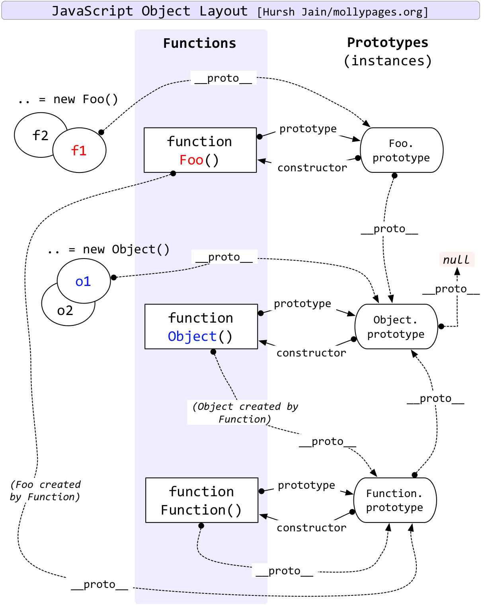

# Function 与 Object 的关系

javascript 中，Function 与 Object 有关系吗？关系是什么？

首先看一张图：


然后我们来分析：

Function 是 Object 的构造者，准确来说，Function 是所有函数的构造者，即 任意函数.constructor === Function 。

Function 作为一个构造函数，所有的函数都是对象，即所有的函数的间接构造者是 Object 。

这就是函数的二义性：

- 当你把 Function 看做一个对象时，它就是由 Object 间接构造出来的。
- 当你把 Function 看做一个函数时，它就是 Object 的构造者。

那到底是 Function 构造了 Object，还是 Object 构造了 Function 呢，答案是他们互相构造了对方，甚至可以说，Function 是 Function 自己构造出来的。

在在我的理解中，不必拘泥于到底是谁构造了谁，其实Function和Object都是由JavaScript引擎生成的，然后互相绑定关系，就像如下代码：

```JavaScript
var a = {};
var b = {};
a.x = b;
b.y = a;
```

我们总能在a的属性上找到b，也总能在b的属性上找到a，这就是JavaScript的魔力。

如下是会出现在面试中，但是基本上不会出现在实际开发中的问题：

```JavaScript
Object instanceof Function // true
Function instanceof Object // true
Function instanceof Function // true
Object instanceof Object // true

Object.__proto__ === Function.prototype // true
Function.__proto__ === Function.prototype // true
```

## 参考文章
- [javascript中,Function与Object有关系吗?关系是什么?](https://www.zhihu.com/question/442270405)
