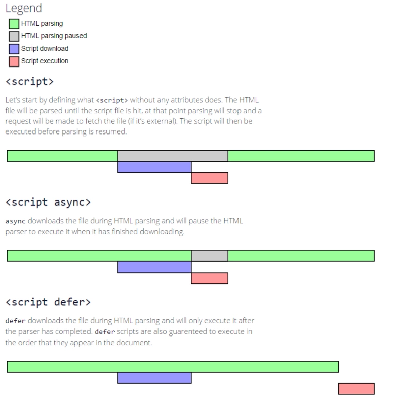

# HTML知识点

## script标签为什么要放在body标签的底部，defer和async是用来做什么的？

因为浏览器在渲染html的时候，从上到下依次执行，遇到js文件就会停止当前页面的渲染，转而去下载js文件，如果将script标签放在头部，如果文件又很大的情况下，首屏时间就会延长，影响用户体验。 解决方法：

1. 将script标签放到body的底部
2. 通过defer\async属性将js文件转为异步下载

**defer\async的区别** 首先都是让js文件能够异步下载，不阻塞页面的渲染 区别就是defer必须等待整个文档渲染完成后才执行 而async在下载完成后，会暂停html的解析，转去执行js。

我们尝试着理解浏览器碰到script脚本时发生了什么：

1. 没有defer或async，浏览器会立即加载并执行该script脚本，“立即”指的是在渲染该 script 标签之下的文档元素之前，也就是说不等待后续载入的文档元素，读到就加载并执行。
2. 有async，加载和渲染后续文档元素的过程将和该script脚本的加载与执行并行进行（异步）。
3. 有defer，加载后续文档元素的过程将和该script脚本的加载并行进行（异步），但是该script脚本的执行要在所有元素解析完成之后，DOMContentLoaded事件触发之前完成。

总体来说，把所有script标签放到body的底部是最佳实践，因为对于旧浏览器来说这是唯一的优化选择，可以保证非脚本的其他一切元素能够以最快的速度得到加载和解析。

下面看一张图：

从这张图可以看到几个要点：

1. defer 和 async 在网络读取（下载）这块儿是一样的，都是异步的（相较于 HTML 解析）
2. 它俩的差别在于脚本下载完之后何时执行，显然 defer 是最接近我们对于应用脚本加载和执行的要求的。
3. 关于 defer，此图未尽之处在于它是按照加载顺序执行脚本的，这是因为HTML5规范要求脚本执行应该按照脚本出现的先后顺序执行，但实际情况下，延迟脚本不一定按照先后顺序执行，也不一定会在DOMContentLoaded事件触发之前执行，所以最好只包含一个延迟脚本。
4. async 则是乱序执行的，对它来说脚本的加载和执行是紧紧挨着的，所以不管你声明的顺序如何，只要它加载完了就会立刻执行。
5. 仔细想想，async 对于应用脚本的用处不大，因为它完全不考虑依赖（哪怕是最低级的顺序执行），不过它对于那些可以不依赖任何脚本或不被任何脚本依赖的脚本来说却是非常合适的，最典型的例子：Google Analytics。

## src 和 href的区别

href是超文本引用，它指向资源的位置，建立与目标文件之间的联系。 src目标是把资源下载到页面中 浏览器解析方式 href 不会阻塞对文档的处理（这就是官方建议使用link引入而不是@import） src 会阻塞对文档的处理，原理同1。
**所以，外链CSS，图片等，都是href，而script用的是src。**

