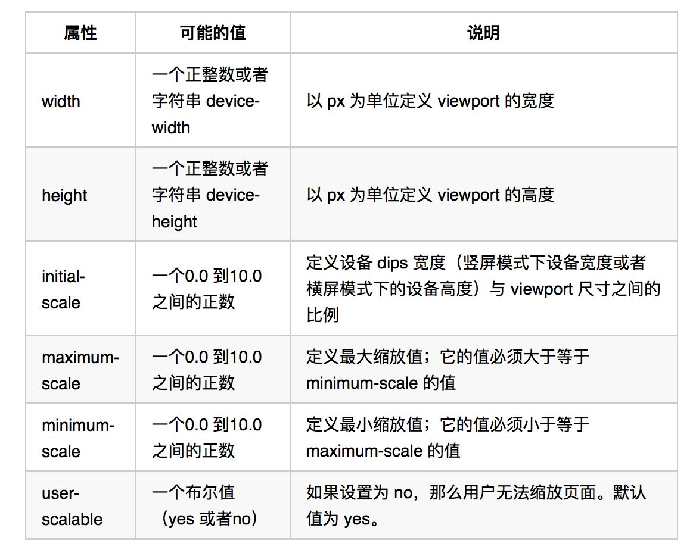

# 移动端名词解释

## 物理像素

也称为设备像素，屏幕的最小物理单位。需要注意的是一个像素并不一定是一个小正方形区块，也没有标准的宽高，只是用于显示丰富色彩的一个“点”而已。可以参考公园里的景观变色彩灯，一个彩灯(物理像素)由红、蓝、绿小灯组成，三盏小灯不同的亮度混合出各种色彩。比如当我们打开 Iphone12 的官网，产品参数里“2340 x 1080 像素分辨率”指的就是设备像素，表示屏幕水平有 1080 个点，垂直有 2340 个点。

## 逻辑像素

也称作设备独立像素。比如我们偶尔会说“电脑屏幕在 2560x1600 分辨率下字太小了，我们把它调为 1440x900”，这里的“分辨率”（非严谨说法）指的就是设备独立像素。可以通过 window.screen.width/ window.screen.height 查看。 另外，平时我们所说的 iphone12mini 的逻辑像素是 375 x 812，iPhone12 Pro Max 的的逻辑像素是 1284 x 2778。

一个设备独立像素里可能包含 1 个或者多个物理像素点，包含的越多则屏幕看起来越清晰。

仅需要物理像素难道不够吗？为什么要有逻辑像素呢？因为物理像素仅代表像素点的个数，并没有有规定一个点实际的尺寸是多少。假设有一个按钮，宽度用 100 个物理像素表示，因屏幕物理像素排列方式和密度的差异，不同屏幕上实际的视觉宽度必然不一样。而逻辑像素相同就表示希望按钮在不同屏幕上看起来一样大。

## PPI (pix per inch)

**PPI 即像素密度，表示每英寸所拥有的物理像素数量。**。以尺寸为 5.4 英寸（屏幕对角线长度）、分辨率为 1080 x 2340 的 iPhone12 mini 为例， `ppi = Math.sqrt(1080*1080 + 2340*2340) / 5.4` ，值为 476PPI。


## CSS 像素

浏览器使用的单位，用来精确度量网页上的内容，比如 `div { width: 100px; }`。 在一般情况下（页面缩放比为 1），1 个 CSS 像素 等于 1 个设备独立像素。比如，假设把屏幕独立像素分辨率设置为 1440x900，给页面元素设置为宽度 720px，则视觉上元素的宽度是屏幕宽度的一半。这也解释了为什么当我们把独立像素分辨率调高后网页的文字感觉变小了。

当页面缩放比不为 1 时，CSS 像素和设备独立像素不再对应。比如当页面放大 200%，则 1 个 CSS 像素等于 4 个设备独立像素。

## 设备像素比

`window.devicePixelRatio`指的是设备物理像素和逻辑像素（device-independent pixels, dips）的比例。window.devicePixelRatio = 物理像素 / 设备独立像素（dips） 。iPhone12mini的DPR是3。

如果现在设备像素比为2，有一张实际宽度为 200px 的高清图片，在浏览器里被 css 设置宽度为 200px，那么这张图片看起来就会有点模糊，因为它实际被硬件扩展到了 400px 的硬件像素宽度，是它实际宽度的两倍。但是，如果它被 css 设置宽度为 100px，这时候它实际被硬件扩展到了 200px 的硬件像素宽度，和它实际像素一致，就不会模糊了。

## viewport

我们知道响应式网站通常要正确设置名称为 viewport 的 meta 信息，才可以正常显示。例如最常用的 viewport 设置方法：

```HTML
<meta name="viewport" content="width=device-width, initial-scale=1">
```

那么什么是 viewport？

**viewport 通常是指用户网页的可视区域，简称”视区“。但是我们这里讨论的 viewport 不仅是这个概念。我们不妨把 viewport 分为 layout viewport、visual viewport 和 ideal viewport 三个概念。**

在移动设备上，layout viewport 并不局限于浏览器可视区域 visual viewport 的大小，可以比浏览器的可视区域大，也可以比浏览器的可视区域小。默认情况下的 viewport 是 layout viewport，它的宽度通常大于浏览器可视区域，也可以说是大于移动设备的 dips 宽度。

需要注意的是，这个没有设置任何 viewport 相关 meta 的情况下，如果当前页面的 layout viewport 大于移动设备的 dips 宽度，为了使得页面不出现横向滚动条，提高用户体验，移动设备通常会自动给整个网页设置一个默认的缩放值来缩小页面。**这就是为什么我们看到一些不是响应式的网站在移动设备如 iphone 和 ipad 中会以整体缩小到刚好布满整个屏幕的形式展现。**

对于已经做好响应式的站点，默认的 layout viewport 宽度就不合时宜了，因为这些站点经过优化在移动设备宽度下也可以正常显示，这时候我们需要一个 ideal viewport，可以通过 width=device-width 来设置 layout viewport 等于设备的 dips 宽度来获得 ideal viewport。

但是还不够，在 iphone 和 ipad 上，无论你给 viewport 设的宽度是多少，如果没有指定默认的缩放值，则 iphone 和 ipad 会自动计算这个缩放值，以达到当前页面不会出现横向滚动条的目的。所以我们还要设置 initial-scale=1 来保证网页在浏览器中一开始就根据屏幕尺寸 1：1 缩放或扩大。需要注意的是，设置 initial-scale=1 其实是让 dips 像素与 CSS 像素的比例达到 1：1。单独通过这个设置也会把当前的 viewport 变为 ideal viewport。

更多 viewport 的设置如下：


## 参考文章
- [响应式网页开发基础：DPR 与 viewport](https://zhuanlan.zhihu.com/p/26131956)